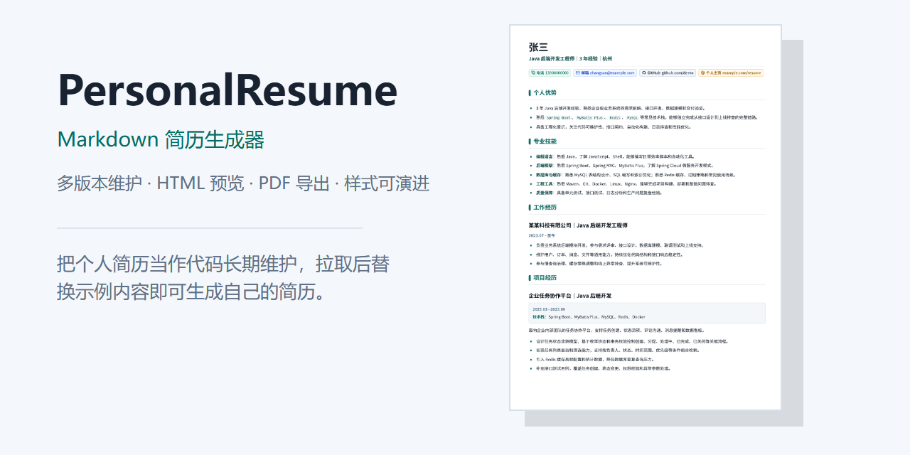
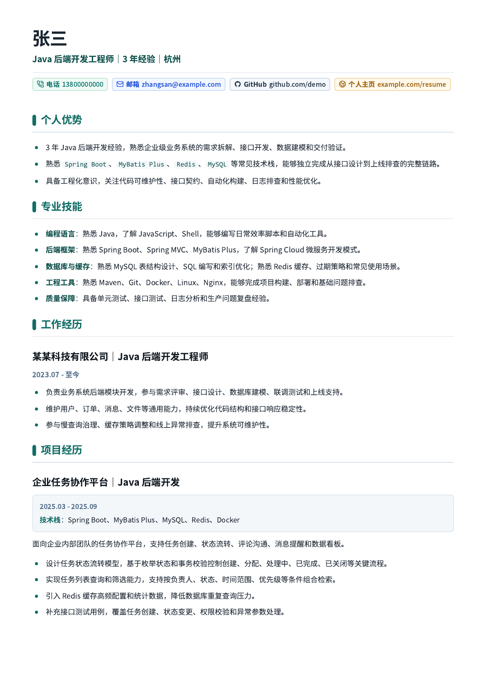

# PersonalResume



PersonalResume 是一个基于 Markdown 的工程化简历模板项目，用代码维护多版本简历，并一键生成 HTML 预览和 A4 PDF。

## 预览



示例内容使用虚拟信息，可直接作为公开模板参考。拉取仓库后复制示例版本，替换为自己的经历、项目和联系方式即可生成个人简历。

## 功能亮点

- 使用 Markdown 维护简历内容，降低排版、复制和版本维护成本。
- 每个简历版本独立维护 `resume.md`、`index.html`、`resume.css`、`resume.pdf`。
- 使用统一 CSS 模板渲染 A4 简历，兼顾浏览器预览和 PDF 打印导出。
- 构建时自动检查基础文件、HTML 结构、CSS 打印规则和 PDF 页数。
- 自动规划项目条目分页，减少标题、技术栈、描述和列表项被割裂的情况。
- 在简历最后一页页脚生成浅色来源水印，并把仓库名渲染为可点击链接。

## 快速开始

安装依赖：

```bash
npm install
```

生成默认示例版本：

```bash
npm run build
```

检查当前产物：

```bash
npm run check
```

生成指定版本：

```bash
npm run build -- --version sample-java-backend
```

生成 PDF 需要本机存在 Chromium 内核浏览器。脚本会优先读取 `RESUME_CHROME_PATH`，也会尝试从常见安装路径中查找 Chrome 或 Edge。

```bash
RESUME_CHROME_PATH=/path/to/chrome npm run build
```

## 修改成自己的简历

1. 复制 `versions/sample-java-backend/` 为新的版本目录，例如 `versions/my-resume/`。
2. 修改新目录中的 `resume.md`，替换姓名、联系方式、经历、项目和教育信息。
3. 在 `resume.config.json` 的 `versions` 下登记新版本，并按需修改 `defaultVersion`。
4. 运行 `npm run build -- --version my-resume` 生成 HTML 和 PDF。

建议版本目录使用稳定英文名，避免跨平台工具处理中文路径时出现兼容问题。

## 配置

常用配置集中在 `resume.config.json`：

| 字段 | 说明 |
| --- | --- |
| `defaultVersion` | 默认构建的简历版本 |
| `versions` | 多版本简历配置 |
| `cssTemplate` | 公共样式模板路径 |
| `watermark` | 页脚来源水印配置 |
| `browserPaths` | Chrome 或 Edge 的候选路径 |
| `pdf` | PDF 导出参数 |

构建链路：

```text
resume.md
↓
index.html
↓
resume.pdf
```

## 项目文档

- [Markdown 简历工程化手册](docs/guide/MD简历渲染手册.md)
- [项目维护说明](docs/项目维护说明.md)

## 水印

构建脚本会在简历最后一页页脚居中生成浅色水印：

```text
本简历由 Richard2091/PersonalResume 生成
```

其中 `Richard2091/PersonalResume` 会带 GitHub 图标，并链接到公开仓库。普通 HTML 预览中水印跟随正文底部，PDF 打印时水印会定位到最后一页页脚。

## 目录结构

```text
PersonalResume/
├── assets/
│   ├── demo/              # README 和 GitHub 展示图片
│   ├── fonts/             # 本地中文字体
│   └── icons/             # 渲染用图标资源
├── docs/
│   ├── guide/             # Markdown 简历编写和发布说明
│   └── 项目维护说明.md    # README、渲染手册和展示图片维护说明
├── export/                # 快捷 HTML 预览入口
├── scripts/               # 构建与检查脚本
├── styles/                # 公共样式模板
├── versions/              # 多版本简历目录
├── resume.config.json     # 简历版本和构建配置
└── package.json
```

## 路线图

- 支持在线网页管理多版本简历。
- 支持在线编辑 Markdown 并实时预览。
- 支持样式主题切换、字体配置和版式自定义。
- 支持 GitHub Pages 或其他静态站点自动发布。
- 支持导入导出不同投递场景的简历版本。

## 开源边界

- 根目录不放个人简历源文件，所有版本统一放在 `versions/` 下。
- `styles/` 存放公共样式模板，版本目录中的 `resume.css` 由构建脚本生成。
- `export/` 只作为快捷预览入口，不作为多版本主线输出目录。
- 公开仓库中不要提交真实个人隐私、投递材料、面试题库或内部项目证据。

## 许可证

[MIT](LICENSE)
